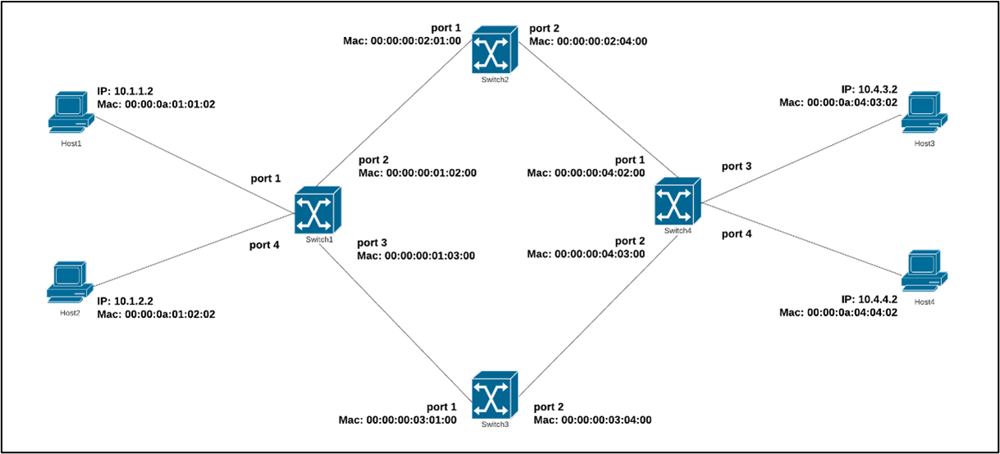

# MPLS Basic Modified Scenario for P4 on Mininet 

P4 on Mininet will be implemented in topology consist of 4 switches and 4 hosts based on the picture below



This project can be reproduced by following these steps 
- Create Python file to setup the topology (see `create_topology.py` file as an example)
- Configure flow rule files for each switch (see `switch_flow_rules.txt` file as an example)
- Select or create P4 program that will be used to run the scenario (see `mpls_basic_modified.p4`)

## Run P4 Program 

To run P4 program on Mininet, run the following command
```bash
  sudo python topology_modif.py 
```
Running this python program will call Network API from P4-Utils extension that we use as an installation base to setup this P4-Mininet testbed. Therefore, Mininet will automatically start and continued with topology creation, port allocation to each node, compile P4 program, run compiled P4 program, populate flow rules in each switch node, and network configuration in each host.

To verify the result, we can try to send PING from host 1 to host 2 or use command such as 'pingall' if our configuration already meet the criteria for our network to be able to send packet to all destination nodes.

## References

[MPLS Basic using P4 in Mininet by P4-Learning](https://github.com/nsg-ethz/p4-learning/tree/master/exercises/04-MPLS/thrift/mpls_basics)