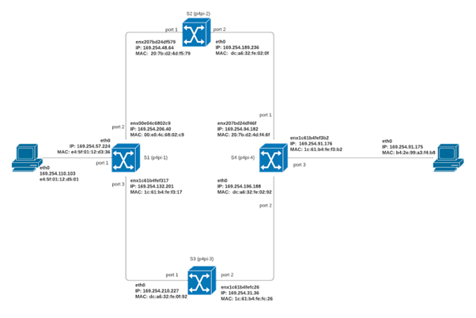

# MPLS Basic Scenario for P4Pi 

P4Pi or P4 for Raspberry Pi will be implemented in topology consist of 4 switches and 2 hosts based on the picture below. We used 4 Raspberry Pi here and each Raspberry Pi will be functioned as a switch.



This project can be reproduced by following these steps.

## Static Routing Configuration for Host

First, we will do network configuration in each host such as setting up an interface, static IP and static ARP.

Host 1
```bash
  sudo ifconfig eth0 169.254.110.103
  sudo ip route add dev eth0 169.254.91.175
  sudo arp -s 169.254.91.175 b4:2e:99:a3:f4:b8
```

Host 2
```bash
  sudo ifconfig eth0 169.254.91.175
  sudo ip route add dev eno1 169.254.110.103
  sudo arp -s 169.254.110.103 e4:5f:01:12:d5:01
```

## Compile and Run P4 Program in Each Switch

To compile P4 program in each switch, run the following command
```bash
  p4c --target bmv2 --arch v1model --std p4-16 basic.p4 
```
We will run compiled P4 program in each switch along with setting up the parameter such as interface, thrift port, device id, and log file.

Switch 1
```bash
  sudo simple_switch --interface 1@eth0 --interface 2@enx00e04c6802c9  --interface 3@enx1c61b4fef317 --thrift-port 9090 --device-id 1 --log-file switch.log basic.json &
```

Switch 2
```bash
  sudo simple_switch --interface 1@enx207bd24df579 --interface 2@eth0 --thrift-port 9090 --device-id 2 --log-file switch.log basic.json &
```

Switch 3
```bash
  sudo simple_switch --interface 1@eth0 --interface 2@enx1c61b4fefc26 --thrift-port 9090 --device-id 3 --log-file switch.log basic.json &
```

Switch 4
```bash
  sudo simple_switch --interface 1@enx207bd24df46f --interface 2@eth0 --interface 3@enx1c61b4fef3b2 --thrift-port 9090 --device-id 4 --log-file switch.log basic.json &
```

## Populate Flow Rules in Each Switch and Verify Result from Hosts

As a last configuration, we will populate each switch with flow rules that have been defined in our txt files using the command below.

```bash
  simple_switch_CLI < switch_flow_rules.txt
```
To verify the result, we can try to send PING from host 1 to host 2 and vice versa.

## References

[P4Pi Simple L3 Forwarding](https://github.com/p4lang/p4pi/wiki/Example-%231-Simple-L3-forwarding-(Bmv2))
[P4 Learning Exercise - MPLS Basic](https://github.com/nsg-ethz/p4-learning/tree/master/exercises/04-MPLS/thrift/mpls_basics)